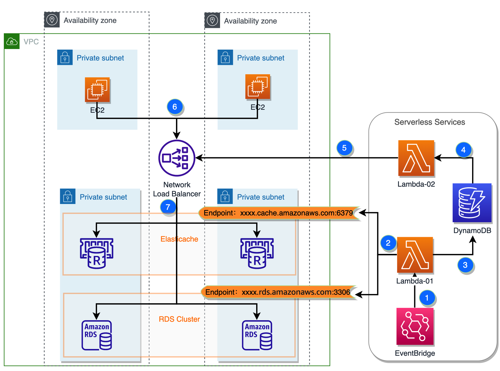
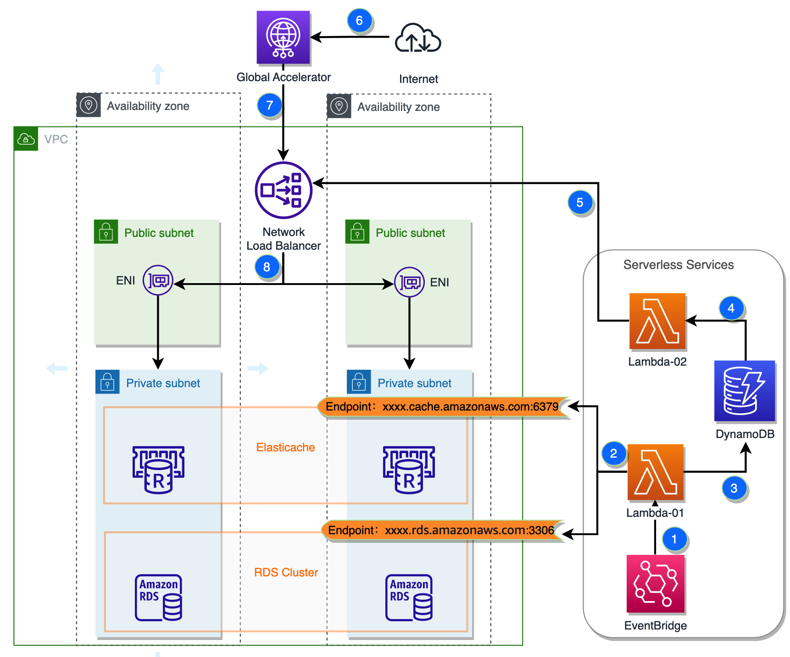

## Enable NLB Support Domain Endpoint as TargetGroup by using Serverless Service 

### Overview

Amazon Web Services provides many excellent hosting services, such as Amazon Managed Streaming for Apache Kafka (Amazon MSK), Amazon ElastiCache, Amazon MemoryDB for Redis, Amazon RDS MySQL, etc. These hosting services can improve the availability and elasticity of workloads, and reduce the operation and management costs of basic resources.

Most Amazon Web Services hosting services provide services through a domain name (DNS Name) based Endpoint, and clients access these services through the domain name Endpoint. But in some scenarios, some customers have some special restrictions that require access to the hosted service through IP or even fixed IP mode or through the Internet to access the intranet hosted service. In this case, some adjustments need to be made to the access method. This article will introduce how to use Network Load Balancer (NLB) to achieve the access to hosted services in special scenarios:

- The request side requires access to the hosted database service (taking RDS MySQL cluster as an example) through IP or fixed IP mode
- The request side is on the Internet and needs to access the hosted service through the Internet (taking Elasticache for Redis service as an example)
    - Note: In order to ensure the security of data transmission, ElastiCache does not support opening Internet access natively. The official document of Amazon Web Services recommends connecting to the VPC internally through a dedicated line or IPsec VPN for secure access. The method of opening intranet hosting services to the Internet for access in this article is recommended for testing and evaluation environments only, and should be used with caution in production environments.

### Solution Architecture (Clients in AWS VPC)
This article demonstrates a serverless approach to working with NLB using Lambda functions, EventBridge, DynamoDB and other key services. This solution is easy to deploy and maintain, and offers good cost-effectiveness, thanks to the serverless architecture.

#### Solution Architecture Description

1.Use Amazon EventBridge to create scheduled tasks and event-triggered tasks to invoke Lambda-01 function.

2.When Lambda-01 function is invoked, it performs DNS queries for the target endpoint domain name and obtains the current IP address list of the endpoint.

3.Lambda-01 stores the obtained IP list (new list) in DynamoDB.

4.DynamoDB invokes Lambda-02 through an event.

5.Lambda-02 retrieves the IP address corresponding to the endpoint domain name from DynamoDB and calls decribe-target-health to query the IP addresses already registered in the current NLB TargetGroup and compare them, performing incremental updates:
 - Register the new IP addresses that appear in the new list to the NLB TargetGroup
 - Deregister the old IP addresses that do not appear in the new list from the NLB TargetGroup

6.The request side (Client) accesses the static IP address of the NLB in the VPC

7.The VPC NLB sends requests from the VPC application side (Client) to the instance IP of the hosted service in the TargetGroup.

 ### Deployment

 

 ([YAML](nlb-access.yaml) for Amazon CloudFormation)

### Extended Solution Architecture (Client Accessing from the Internet Scenario)

In the above steps, we have achieved the goal of using NLB to distribute requests to domain names as its target group, allowing the request side to directly access the hosted service through the fixed VPC IP of the NLB. If we need to access it through the Internet, we need to slightly extend the above solution.

## Security

See [CONTRIBUTING](CONTRIBUTING.md#security-issue-notifications) for more information.

## License

This library is licensed under the MIT-0 License. See the LICENSE file.

